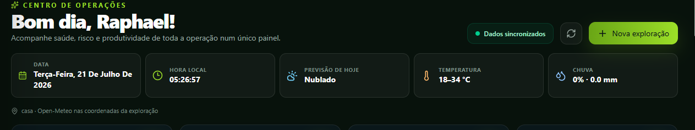
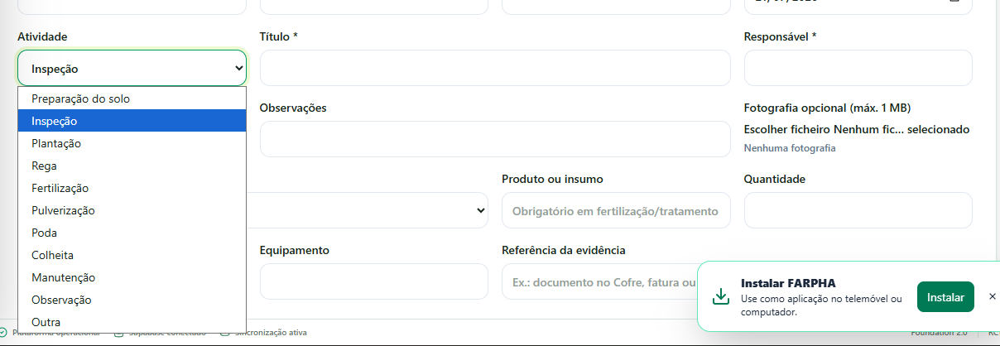

# FARPHA

**Intelligence for Agriculture**

O FARPHA é uma plataforma AgTech/GIS para organizar explorações, talhões,
operações, custos, conformidade e apoio à decisão agrícola numa experiência
única para computador, tablet e telemóvel.

## Estado atual

O projeto encontra-se em **fase pré-comercial**. A base funcional e visual está
implementada, mas a publicação pública depende da conclusão do
[Plano Mestre Pré-Publicação](docs/PRE_PUBLICATION_MASTER_PLAN.md), de testes com
explorações reais e da validação das integrações externas.

| Área | Estado |
| --- | --- |
| Página institucional, autenticação e onboarding | Implementado |
| Explorações, talhões e edição GIS | Implementado, em auditoria de profundidade |
| Operações, custos, inventário e conformidade | Implementado, em auditoria de persistência |
| Supabase, autenticação e políticas RLS | Implementado, sujeito a validação contínua |
| Centro de Ajuda, pedidos e fallback local | Implementado |
| Inteligência FARPHA online | Integração segura criada; requer quota e validação agrícola |
| Stripe e faturação comercial | Requer configuração de produção |
| Digital Twin, IoT, satélite, drones e mobile nativo | Roadmap; não anunciar como concluído |

A classificação completa e verificável de 44 módulos está na
[Matriz de Maturidade](docs/MODULE_MATURITY_MATRIX.md) e dentro da página
**Diagnóstico** da aplicação.

## Aplicação em execução

As imagens abaixo são capturas reais fornecidas durante a execução local. Não
são conceitos gerados nem resultados agrícolas simulados.

### Centro de Operações — tema escuro



### Diário do talhão — tema claro



O manifesto, a origem e o fluxo de atualização estão em
[`docs/screenshots/manifest.json`](docs/screenshots/manifest.json) e no
[Guia de Demonstração Pública](docs/PUBLIC_DEMO_GUIDE.md).

Dados, percentagens e resultados exibidos em experiências demonstrativas não
representam resultados agrícolas comprovados.

## Diferenciais técnicos

- Gestão de explorações e talhões ligada ao território.
- MapLibre, Turf, Terra Draw, GeoJSON e importação geográfica.
- React 19, TypeScript, Vite, Tailwind CSS e React Query.
- Supabase para autenticação, persistência, RLS e Edge Functions.
- Inteligência server-side sem exposição da chave privada no navegador.
- PWA, carregamento progressivo e módulos carregados de forma preguiçosa.
- Testes, lint, build, smoke test, CodeQL, Dependabot e auditoria do repositório.

## Execução local

Requisitos: Node.js conforme `frontend/.nvmrc` e npm.

```bash
git clone https://github.com/Raphaelsantos10/AgriOS.git
cd AgriOS/frontend
cp .env.example .env.local
npm install
npm run validate
npm run dev
```

Configure `frontend/.env.local` com os valores públicos do seu projeto
Supabase. Nunca coloque `service_role`, `OPENAI_API_KEY` ou outras chaves
privadas no frontend.

## Validação

```bash
cd frontend
npm run validate
```

O comando verifica toolchain, integridade do repositório, identidade FARPHA,
entrada pública, testes, lint, build, PWA, segurança, manifesto e smoke test.

## Estrutura

```text
AgriOS/
├── .github/          # CI, CodeQL, releases, Dependabot e auditoria
├── database/         # migrações SQL versionadas
├── design/           # ativos oficiais da identidade FARPHA
├── docs/             # arquitetura, segurança, sprints e operação
├── frontend/         # aplicação React/TypeScript
└── supabase/         # Edge Functions e configuração do backend
```

## Documentação essencial

- [Plano Mestre Pré-Publicação](docs/PRE_PUBLICATION_MASTER_PLAN.md)
- [Índice documental](docs/DOCUMENTATION_INDEX.md)
- [Matriz de maturidade dos módulos](docs/MODULE_MATURITY_MATRIX.md)
- [Guia do utilizador](docs/USER_GUIDE.md)
- [Guia de administração](docs/ADMIN_GUIDE.md)
- [Visão técnica](docs/TECHNICAL_OVERVIEW.md)
- [Guia de demonstração pública](docs/PUBLIC_DEMO_GUIDE.md)
- [Governança da identidade FARPHA](docs/brand/FARPHA_IDENTITY_GOVERNANCE.md)
- [Política de arquivo](docs/ARCHIVE_POLICY.md)
- [Como contribuir](CONTRIBUTING.md)
- [Baseline de segurança](docs/security/REPOSITORY_SECURITY_BASELINE.md)
- [Política de segurança](SECURITY.md)
- [Runbook de produção](docs/PRODUCTION_RUNBOOK.md)
- [Backup e recuperação](docs/BACKUP_RECOVERY.md)
- [Histórico de alterações](CHANGELOG.md)

O conjunto definitivo de capturas, vídeo e demonstração pública será produzido
na Sprint 109 depois da classificação de maturidade dos módulos, evitando
apresentar telas demonstrativas como integrações reais.

O nome histórico do repositório continua temporariamente `AgriOS`. A aplicação,
o pacote frontend e a identidade pública já utilizam FARPHA. A mudança do URL
será feita manualmente depois da validação, seguindo
[`RENOMEAR_REPOSITORIO_FARPHA.txt`](RENOMEAR_REPOSITORIO_FARPHA.txt).

## Autor

Raphael Soares — Portugal

## Licença

As versões já publicadas sob licença MIT mantêm os direitos concedidos por essa
licença. A estratégia de licenciamento das versões comerciais futuras será
avaliada antes da publicação do FARPHA.
